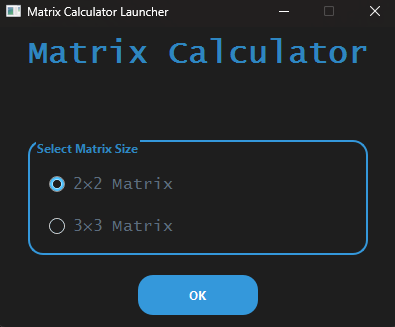
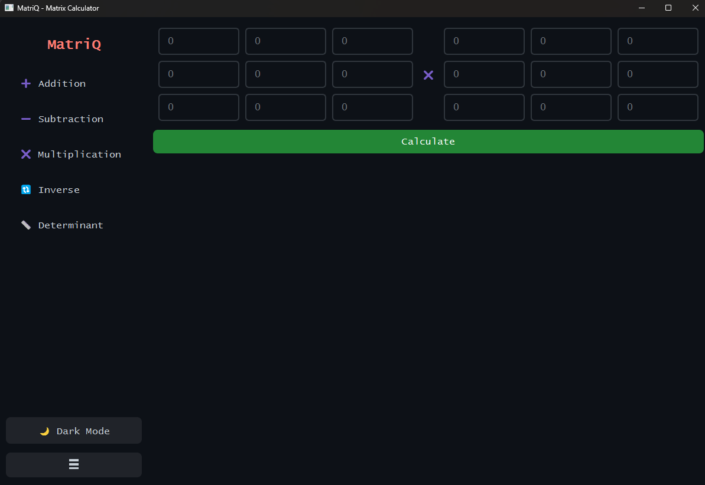
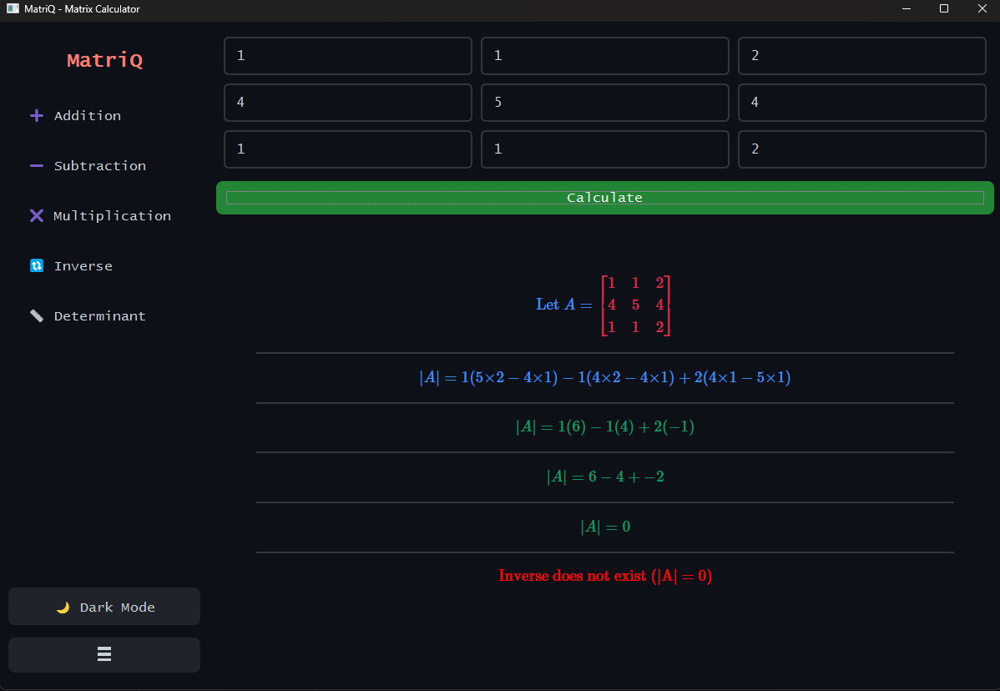

# 🧮 Step-by-Step Matrix Calculator

A beginner-friendly desktop app that **solves 2×2 and 3×3 matrix operations step-by-step** — made for students, math enthusiasts, and educators. Built using **PyQt6** with a clean and modern GUI, this tool doesn’t just give the answer — it **shows every step** involved in calculating matrix addition, subtraction, multiplication, determinant, and inverse.

## 🎥 Demo Video


https://github.com/user-attachments/assets/de2c1f42-453d-43ce-a136-72712763efb3


---

## ✨ Features

- ✅ **2×2 and 3×3 Matrix Support**
- 🧠 **Step-by-step breakdown** of:
  - Addition
  - Subtraction
  - Multiplication
  - Determinant
  - Inverse
- 🎨 Beautiful, minimal GUI using **PyQt6**
- 🎯 Easy matrix size selection screen
- 🌙 Light/Dark theme support *(if implemented)*
- 🔍 Perfect for learning matrix fundamentals through visualization

---

---

## 📸 Screenshots

| Home Screen | Multiplication Operation | Inverse Step-by-Step            |
|-------------|--------------------------|---------------------------------|
|  |  |  |

---
> - Home launcher with 2×2 / 3×3 matrix selection
> - Example of step-by-step inverse or multiplication

---

## 🛠️ Tech Stack

| Tech        | Purpose                        |
|-------------|--------------------------------|
| Python 3.11 | Core programming language      |
| PyQt6       | GUI framework                  |
| NumPy       | Matrix calculations            |
| SymPy       | Symbolic math (if used)        |
| MathJax     | For displaying math in steps   |
| PyQt6-WebEngine | (If MathJax used via web)  |

---

## 🗂️ Project Structure
```
MatrixCalC/
│
├── two/ # 2×2 Matrix logic modules
│ ├── addition.py
│ ├── subtraction.py
│ ├── multiplication.py
│ ├── inverse.py
│ └── determinent.py
│
├── three/ # 3×3 Matrix logic modules
│ ├── addition.py
│ ├── subtraction.py
│ ├── multiplication.py
│ ├── inverse.py
│ └── determinent.py
│
├── main.py # GUI launcher (matrix size selector)
├── requirements.txt
└── README.md
└── assets (Images and Video)

```
---

## ⚙️ Installation & Running the App

> 🔴 **Note:** This project requires **Python 3.11**. PyQt6 does not support earlier versions.

### 🔹 1. Clone the Repository

```bash
git clone https://github.com/IsaShaikh/MatrixCalC.git
cd MatrixCalC
```

### 🔹 2. Create a Virtual Environment (Recommended)
```bash

python -m venv venv
source venv/bin/activate        # On Linux/macOS
venv\Scripts\activate           # On Windows
```

### 🔹 3. Install Dependencies
```bash

pip install -r requirements.txt
```

### 🔹 4. Run the Application

```bash
python main.py
```
That’s it! The launcher will appear — choose 2×2 or 3×3 matrix and start solving 📐

---
## 📄 Requirements
Inside requirements.txt:

```bash

PyQt6==6.5.2
numpy>=1.24
sympy>=1.12
matplotlib>=3.7
PyQt6-WebEngine>=6.5  # Only needed if using QWebEngine for MathJax
```
---
## 📜 License
This project is released under the MIT License — free for personal, educational, and commercial use. See the LICENSE file for more details.

### ‍🙋 Author
Developed with ❤️ by Isa Shaikh

GitHub: @IsaShaikh

---
Project Repository: MatrixCalC


## 📌 Future Plans
 Export solutions as PDF

 Add support for 4×4 and higher-order matrices

 Animated row/column operations

 Online matrix fetch via API (experimental)

---
📥 Contribution
Contributions are welcome! If you're a beginner in Python or PyQt, feel free to fork, modify, or raise an issue. This project is designed to be simple, clean, and educational.

